# TriModalFusion: Unified Multimodal Recognition System

[](https://www.python.org/downloads/)
[](https://pytorch.org/)
[](https://opensource.org/licenses/MIT)

TriModalFusion is a deep learning framework for multimodal recognition that integrates speech, gesture, and image processing capabilities. The system implements state-of-the-art architectures including Transformer networks, MediaPipe hand tracking, and Vision Transformers to provide a unified computational platform for multimodal artificial intelligence applications.

## Key Features

### Multi-Modal Processing
- **Speech Recognition**: Transformer-based encoder architecture for audio sequence processing
- **Gesture Recognition**: MediaPipe hand tracking integrated with Graph Convolutional Networks for spatial-temporal gesture analysis  
- **Image Recognition**: Vision Transformer and Convolutional Neural Network architectures with optional object detection capabilities
- **Cross-Modal Fusion**: Multi-head attention mechanisms for cross-modal feature integration

### Cross-Modal Fusion Mechanisms
- **Temporal Alignment**: Multi-scale temporal synchronization for variable-length sequences
- **Semantic Alignment**: Contrastive learning approach for unified cross-modal representation space
- **Hierarchical Fusion**: Progressive information integration across feature, semantic, and decision abstraction levels
- **Cross-Modal Attention**: Bidirectional attention computation between modality representations

### System Architecture
- **Modular Design**: Component-based architecture supporting extensible modality integration
- **Multi-Task Learning**: Support for classification, object detection, regression, and sequence generation tasks
- **Configuration Management**: YAML-based parameter configuration system
- **Evaluation Framework**: Comprehensive metrics computation and model checkpointing capabilities

## Quick Start

### Installation

```bash
git clone https://github.com/your-repo/TriModalFusion.git
cd TriModalFusion
pip install -r requirements.txt
```

### Basic Usage

```python
import torch
from src.models.trimodal_fusion import TriModalFusionModel
from src.utils.config import load_config

# Load configuration
config = load_config("configs/default_config.yaml")

# Create model
model = TriModalFusionModel(config)

# Prepare multimodal inputs
inputs = {
    'speech': torch.randn(2, 16000),          # Audio: [batch, samples]
    'gesture': torch.randn(2, 30, 2, 21, 3), # Keypoints: [batch, time, hands, joints, coords]
    'image': torch.randn(2, 3, 224, 224)     # Images: [batch, channels, height, width]
}

# Forward pass
outputs = model(inputs)
predictions = outputs['task_outputs']['classification']
```

### Training Example

```python
# Set up training
model.train()
optimizer = torch.optim.AdamW(model.parameters(), lr=1e-4)

# Training step
outputs = model(inputs)
targets = {'classification': torch.randint(0, 10, (2,))}
losses = model.compute_loss(outputs, targets)

losses['total_loss'].backward()
optimizer.step()
optimizer.zero_grad()
```

## Architecture Overview

### System Architecture



```mermaid
graph TB
    subgraph "Input Layer"
        A1[Speech Input<br/>16kHz Audio]
        A2[Gesture Input<br/>Video/Keypoints]
        A3[Image Input<br/>224×224 RGB]
    end
    
    subgraph "Encoding Layer"
        B1[Speech Encoder<br/>Transformer]
        B2[Gesture Encoder<br/>MediaPipe + GCN]
        B3[Image Encoder<br/>ViT/ResNet]
    end
    
    subgraph "Fusion Layer"
        C1[Temporal Alignment]
        C2[Semantic Alignment]
        C3[Cross-Modal Attention]
    end
    
    subgraph "Integration Layer"
        D1[Feature-Level Fusion]
        D2[Semantic-Level Fusion]
        D3[Decision-Level Fusion]
    end
    
    subgraph "Output Layer"
        E1[Classification Head]
        E2[Detection Head]
        E3[Regression Head]
    end
    
    A1 --> B1
    A2 --> B2
    A3 --> B3
    
    B1 --> C1
    B2 --> C1
    B3 --> C1
    
    B1 --> C2
    B2 --> C2
    B3 --> C2
    
    B1 --> C3
    B2 --> C3
    B3 --> C3
    
    C1 --> D1
    C2 --> D2
    C3 --> D3
    
    D1 --> E1
    D2 --> E1
    D3 --> E1
    
    D1 --> E2
    D2 --> E2
    D3 --> E2
    
    D1 --> E3
    D2 --> E3
    D3 --> E3
    
    classDef inputStyle fill:#e1f5fe,stroke:#0288d1,stroke-width:2px
    classDef encoderStyle fill:#f3e5f5,stroke:#7b1fa2,stroke-width:2px
    classDef fusionStyle fill:#e8f5e8,stroke:#388e3c,stroke-width:2px
    classDef integrationStyle fill:#fff3e0,stroke:#f57c00,stroke-width:2px
    classDef outputStyle fill:#fce4ec,stroke:#c2185b,stroke-width:2px
    
    class A1,A2,A3 inputStyle
    class B1,B2,B3 encoderStyle
    class C1,C2,C3 fusionStyle
    class D1,D2,D3 integrationStyle
    class E1,E2,E3 outputStyle
```

### Data Flow Architecture


### Component Details

#### Speech Encoder
- **Mel-Spectrogram Extraction**: 80-channel mel-frequency cepstral coefficient computation
- **Transformer Architecture**: Multi-head self-attention layers with learned positional encodings
- **Feature Aggregation**: Configurable pooling strategies including mean, max, attention-weighted, and classification token pooling

#### Gesture Encoder
- **Hand Keypoint Detection**: MediaPipe framework for real-time 21-landmark hand pose estimation
- **Graph Convolutional Network**: Spatial relationship modeling of hand skeletal structure
- **Temporal Convolutional Network**: Multi-scale temporal pattern recognition in gesture sequences

#### Image Encoder
- **Vision Transformer**: Patch-based image tokenization with multi-head self-attention computation
- **Convolutional Neural Networks**: Support for ResNet and EfficientNet backbone architectures
- **Object Detection**: DETR-style detection head for bounding box regression and classification

#### Fusion Mechanisms
- **Temporal Alignment**: Interpolation-based, attention-weighted, and learnable temporal synchronization methods
- **Semantic Alignment**: Contrastive learning optimization with cosine similarity and bilinear transformations
- **Cross-Modal Attention**: Multi-head attention computation across modality feature representations
- **Hierarchical Integration**: Progressive information fusion across multiple abstraction levels

## Performance Metrics

The framework implements comprehensive quantitative evaluation metrics:

### Speech Recognition Metrics
- **Word Error Rate (WER)**: Standard automatic speech recognition accuracy metric
- **Character Error Rate (CER)**: Character-level transcription accuracy measurement
- **BLEU Score**: Bilingual evaluation understudy score for text similarity assessment

### Gesture Recognition Metrics
- **Classification Accuracy**: Multi-class gesture recognition accuracy
- **Keypoint Localization Error**: Mean squared error and mean absolute error for keypoint coordinate prediction
- **Temporal Consistency**: Temporal smoothness measurement of gesture sequence predictions

### Image Recognition Metrics
- **Top-1/Top-5 Accuracy**: Standard multi-class image classification accuracy metrics
- **Mean Average Precision (mAP)**: Object detection performance evaluation across multiple IoU thresholds
- **Intersection over Union Analysis**: Bounding box localization quality assessment

### Multimodal Fusion Metrics
- **Modality Contribution Analysis**: Quantitative assessment of individual modality importance via ablation studies
- **Fusion Effectiveness**: Performance improvement quantification relative to unimodal baselines
- **Cross-Modal Correlation**: Inter-modality feature similarity and alignment measurement

## Configuration

The system uses YAML configuration files for easy customization:

```yaml
model:
  d_model: 512
  tasks: ["classification"]
  num_classes: 10

speech_config:
  sample_rate: 16000
  n_mels: 80
  pooling: "attention"

gesture_config:
  num_hands: 2
  use_mediapipe: true
  spatial_aggregation: "attention"

image_config:
  image_architecture: "vit"
  img_size: 224

fusion_config:
  fusion_strategy: "attention"
  alignment_method: "interpolation"

training:
  optimizer: "adamw"
  learning_rate: 1e-4
  batch_size: 32
```

## Examples

### Real-World Applications

```python
# Example 1: Gesture-controlled interface
inputs = {
    'gesture': extract_keypoints_from_video(video_frames),
    'speech': record_audio_command()
}
action = model.inference(inputs, task='classification')

# Example 2: Multimodal content analysis
inputs = {
    'image': load_image("scene.jpg"),
    'speech': transcribe_audio("description.wav"),
    'gesture': detect_pointing_gesture(video_frames)
}
understanding = model.extract_features(inputs)

# Example 3: Accessibility application
inputs = {
    'gesture': sign_language_video,
    'speech': spoken_description,
    'image': context_image
}
translation = model.inference(inputs, task='generation')
```

### Training Custom Models

```python
# Custom configuration
config = {
    'model': {'d_model': 256, 'tasks': ['classification']},
    'speech_config': {'pooling': 'cls'},
    'gesture_config': {'spatial_aggregation': 'attention'},
    'image_config': {'image_architecture': 'cnn'},
    'fusion_config': {'fusion_strategy': 'adaptive'}
}

# Initialize model
model = TriModalFusionModel(config)

# Custom dataset
class MultimodalDataset(torch.utils.data.Dataset):
    def __init__(self, data_path):
        # Load your multimodal dataset
        pass
    
    def __getitem__(self, idx):
        # Return {'speech': ..., 'gesture': ..., 'image': ...}, targets
        pass

# Training loop
dataset = MultimodalDataset("path/to/data")
dataloader = torch.utils.data.DataLoader(dataset, batch_size=32)

for batch in dataloader:
    inputs, targets = batch
    outputs = model(inputs)
    losses = model.compute_loss(outputs, targets)
    losses['total_loss'].backward()
    optimizer.step()
    optimizer.zero_grad()
```

## Research Applications

### Research Applications
- **Human-Computer Interaction**: Development of natural multimodal user interfaces
- **Accessibility Technology**: Automated sign language recognition and translation systems
- **Behavioral Analysis**: Computational analysis of human communication patterns
- **Robotics**: Multimodal perception systems for human-robot interaction
- **Clinical Assessment**: Medical evaluation through multimodal behavioral analysis

### Research Features
- **Reproducible Experiments**: Comprehensive configuration management and experimental logging
- **Ablation Analysis**: Modular architecture enabling systematic component evaluation
- **Benchmark Evaluation**: Standardized evaluation protocols for research comparison
- **Architecture Extensibility**: Framework design supporting integration of novel modalities and architectures

## Documentation

### API Documentation
- [Model Architecture](docs/model_architecture.md)
- [Configuration Guide](docs/configuration.md)
- [Training Guide](docs/training.md)
- [Evaluation Metrics](docs/evaluation.md)

### Tutorials
- [Getting Started](docs/getting_started.md)
- [Custom Datasets](docs/custom_datasets.md)
- [Advanced Configuration](docs/advanced_config.md)
- [Deployment Guide](docs/deployment.md)

## Contributing

We welcome contributions! Please see [CONTRIBUTING.md](CONTRIBUTING.md) for guidelines.

### Development Setup
```bash
# Clone repository
git clone https://github.com/your-repo/TriModalFusion.git
cd TriModalFusion

# Install development dependencies
pip install -r requirements-dev.txt

# Run tests
python -m pytest tests/

# Code formatting
black src/ tests/
flake8 src/ tests/
```

## License

This project is licensed under the MIT License - see the [LICENSE](LICENSE) file for details.

## Acknowledgments

- **MediaPipe**: Google Research framework for multimodal perception pipelines
- **Whisper**: OpenAI's robust automatic speech recognition system via large-scale weak supervision
- **Vision Transformer**: Dosovitskiy et al., "An Image is Worth 16x16 Words: Transformers for Image Recognition at Scale"
- **PyTorch**: Facebook AI Research deep learning framework
- **Hugging Face Transformers**: Open-source transformer architecture library and model repository

## Contact

- **Issues**: [GitHub Issues](https://github.com/your-repo/TriModalFusion/issues)
- **Discussions**: [GitHub Discussions](https://github.com/your-repo/TriModalFusion/discussions)
- **Email**: research@trimodal.ai

---

**TriModalFusion** - A unified computational framework for multimodal human communication analysis.