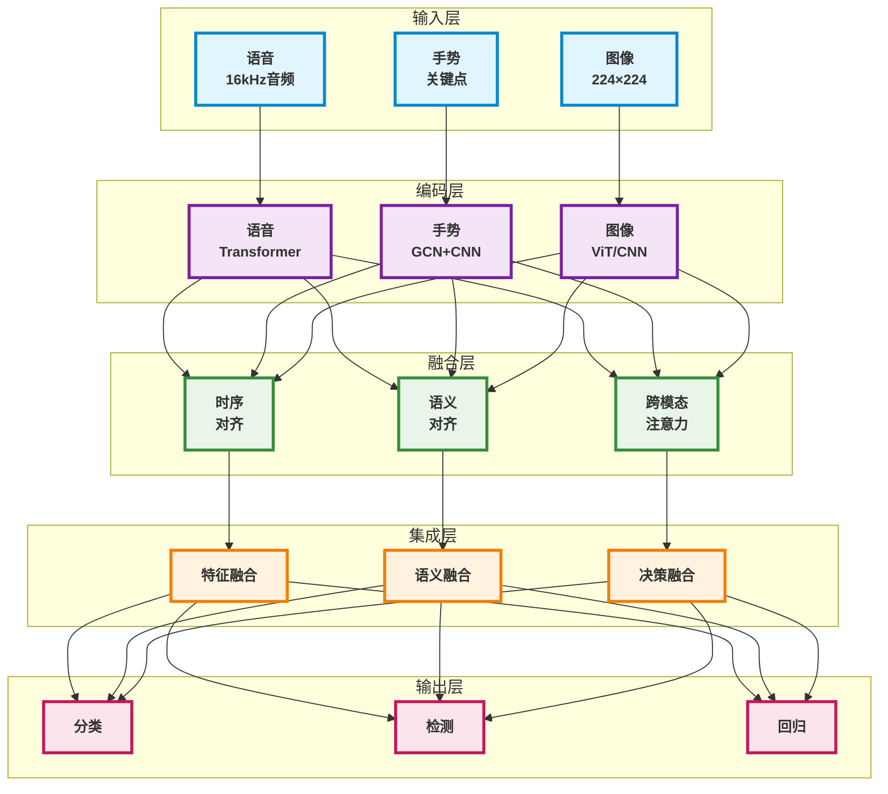
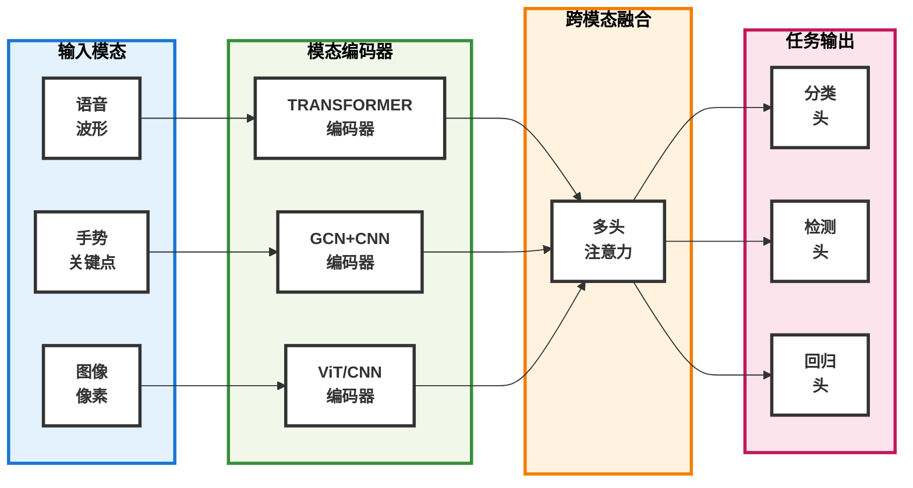

# TriModalFusion: 统一多模态识别系统

<p align="right">
<strong>语言</strong>: <a href="README.md">English</a> | <a href="README_CN.md">中文</a>
</p>

<div align="center">

[](https://www.python.org/downloads/)
[](https://pytorch.org/)
[](https://lightning.ai/)
[](https://huggingface.co/transformers/)
[](https://opencv.org/)
[](https://opensource.org/licenses/MIT)

[](#)
[](#)
[](#)
[](#)
[](https://www.docker.com/)
[](https://kubernetes.io/)
[](https://developer.nvidia.com/cuda-toolkit)

</div>

TriModalFusion是一个集成语音、手势和图像处理能力的深度学习多模态识别框架。该系统实现了包括Transformer网络、MediaPipe手部追踪和视觉Transformer在内的最新架构，为多模态人工智能应用提供统一的计算平台。

## 核心特性

### 多模态处理
- **语音识别**: 基于Transformer的编码器架构，用于音频序列处理
- **手势识别**: MediaPipe手部追踪与图卷积网络相结合，进行时空手势分析
- **图像识别**: 视觉Transformer和卷积神经网络架构，支持可选的目标检测能力
- **跨模态融合**: 多头注意力机制实现跨模态特征集成

### 跨模态融合机制
- **时序对齐**: 针对变长序列的多尺度时序同步
- **语义对齐**: 通过对比学习方法构建统一的跨模态表示空间
- **层次化融合**: 在特征、语义和决策抽象层面的渐进信息集成
- **跨模态注意力**: 模态表示间的双向注意力计算

### 系统架构
- **模块化设计**: 基于组件的架构，支持可扩展的模态集成
- **多任务学习**: 支持分类、目标检测、回归和序列生成任务
- **配置管理**: 基于YAML的参数配置系统
- **评估框架**: 综合指标计算和模型检查点能力

## 快速开始

### 安装

```bash
git clone https://github.com/Nathanielneil/TriModalFusion.git
cd TriModalFusion
pip install -r requirements.txt
```

### 基本使用

```python
import torch
from src.models.trimodal_fusion import TriModalFusionModel
from src.utils.config import load_config

# 加载配置
config = load_config("configs/default_config.yaml")

# 创建模型
model = TriModalFusionModel(config)

# 准备多模态输入
inputs = {
    'speech': torch.randn(2, 16000),          # 音频: [批次, 采样点]
    'gesture': torch.randn(2, 30, 2, 21, 3), # 关键点: [批次, 时间, 手数, 关节, 坐标]
    'image': torch.randn(2, 3, 224, 224)     # 图像: [批次, 通道, 高度, 宽度]
}

# 前向传播
outputs = model(inputs)
predictions = outputs['task_outputs']['classification']
```

### 训练示例

```python
# 设置训练
model.train()
optimizer = torch.optim.AdamW(model.parameters(), lr=1e-4)

# 训练步骤
outputs = model(inputs)
targets = {'classification': torch.randint(0, 10, (2,))}
losses = model.compute_loss(outputs, targets)

losses['total_loss'].backward()
optimizer.step()
optimizer.zero_grad()
```

## 架构概览

### 系统架构



### 数据流架构



### 组件详细说明

#### 语音编码器
- **梅尔频谱图提取**: 80通道梅尔频率倒谱系数计算
- **Transformer架构**: 具有学习位置编码的多头自注意力层
- **特征聚合**: 可配置的池化策略，包括均值、最大值、注意力加权和分类令牌池化

#### 手势编码器
- **手部关键点检测**: MediaPipe框架实现实时21个地标点手部姿态估计
- **图卷积网络**: 手部骨骼结构的空间关系建模
- **时序卷积网络**: 手势序列中的多尺度时序模式识别

#### 图像编码器
- **视觉Transformer**: 基于块的图像令牌化与多头自注意力计算
- **卷积神经网络**: 支持ResNet和EfficientNet主干架构
- **目标检测**: DETR风格的检测头，用于边界框回归和分类

#### 融合机制
- **时序对齐**: 基于插值、注意力加权和可学习的时序同步方法
- **语义对齐**: 使用余弦相似度和双线性变换的对比学习优化
- **跨模态注意力**: 跨模态特征表示的多头注意力计算
- **层次化集成**: 多个抽象层面的渐进信息融合

## 性能指标

该框架实现了全面的定量评估指标：

### 语音识别指标
- **词错误率(WER)**: 标准自动语音识别准确率指标
- **字符错误率(CER)**: 字符级转录准确率测量
- **BLEU分数**: 双语评估替代分数，用于文本相似度评估

### 手势识别指标
- **分类准确率**: 多类别手势识别准确率
- **关键点定位误差**: 关键点坐标预测的均方误差和平均绝对误差
- **时序一致性**: 手势序列预测的时序平滑度测量

### 图像识别指标
- **Top-1/Top-5准确率**: 标准多类别图像分类准确率指标
- **平均精度均值(mAP)**: 多个IoU阈值下的目标检测性能评估
- **交并比分析**: 边界框定位质量评估

### 多模态融合指标
- **模态贡献分析**: 通过消融研究定量评估单个模态重要性
- **融合有效性**: 相对于单模态基准的性能提升量化
- **跨模态相关性**: 模态间特征相似度和对齐度测量

## 配置

系统使用YAML配置文件以便于自定义：

```yaml
model:
  d_model: 512
  tasks: ["classification"]
  num_classes: 10

speech_config:
  sample_rate: 16000
  n_mels: 80
  pooling: "attention"

gesture_config:
  num_hands: 2
  use_mediapipe: true
  spatial_aggregation: "attention"

image_config:
  image_architecture: "vit"
  img_size: 224

fusion_config:
  fusion_strategy: "attention"
  alignment_method: "interpolation"

training:
  optimizer: "adamw"
  learning_rate: 1e-4
  batch_size: 32
```

## 示例

### 实际应用

```python
# 示例1: 手势控制界面
inputs = {
    'gesture': extract_keypoints_from_video(video_frames),
    'speech': record_audio_command()
}
action = model.inference(inputs, task='classification')

# 示例2: 多模态内容分析
inputs = {
    'image': load_image("scene.jpg"),
    'speech': transcribe_audio("description.wav"),
    'gesture': detect_pointing_gesture(video_frames)
}
understanding = model.extract_features(inputs)

# 示例3: 无障碍应用
inputs = {
    'gesture': sign_language_video,
    'speech': spoken_description,
    'image': context_image
}
translation = model.inference(inputs, task='generation')
```

### 自定义模型训练

```python
# 自定义配置
config = {
    'model': {'d_model': 256, 'tasks': ['classification']},
    'speech_config': {'pooling': 'cls'},
    'gesture_config': {'spatial_aggregation': 'attention'},
    'image_config': {'image_architecture': 'cnn'},
    'fusion_config': {'fusion_strategy': 'adaptive'}
}

# 初始化模型
model = TriModalFusionModel(config)

# 自定义数据集
class MultimodalDataset(torch.utils.data.Dataset):
    def __init__(self, data_path):
        # 加载您的多模态数据集
        pass
    
    def __getitem__(self, idx):
        # 返回 {'speech': ..., 'gesture': ..., 'image': ...}, targets
        pass

# 训练循环
dataset = MultimodalDataset("path/to/data")
dataloader = torch.utils.data.DataLoader(dataset, batch_size=32)

for batch in dataloader:
    inputs, targets = batch
    outputs = model(inputs)
    losses = model.compute_loss(outputs, targets)
    losses['total_loss'].backward()
    optimizer.step()
    optimizer.zero_grad()
```

## 研究应用

### 研究应用
- **人机交互**: 开发自然多模态用户界面
- **无障碍技术**: 自动手语识别和翻译系统
- **行为分析**: 人类交流模式的计算分析
- **机器人学**: 人机交互的多模态感知系统
- **临床评估**: 通过多模态行为分析进行医疗评估

### 研究特性
- **可重现实验**: 全面的配置管理和实验记录
- **消融分析**: 模块化架构支持系统组件评估
- **基准评估**: 标准化评估协议用于研究比较
- **架构可扩展性**: 框架设计支持新模态和架构的集成

## 文档

### API文档
- [模型架构](docs/model_architecture.md)
- [配置指南](docs/configuration.md)
- [训练指南](docs/training.md)
- [评估指标](docs/evaluation.md)

### 教程
- [入门指南](docs/getting_started.md)
- [自定义数据集](docs/custom_datasets.md)
- [高级配置](docs/advanced_config.md)
- [部署指南](docs/deployment.md)

## 贡献

我们欢迎贡献！请查看[CONTRIBUTING.md](CONTRIBUTING.md)了解指南。

### 开发环境设置
```bash
# 克隆仓库
git clone https://github.com/Nathanielneil/TriModalFusion.git
cd TriModalFusion

# 安装开发依赖
pip install -r requirements-dev.txt

# 运行测试
python -m pytest tests/

# 代码格式化
black src/ tests/
flake8 src/ tests/
```

## 许可证

该项目采用MIT许可证 - 详情请查看[LICENSE](LICENSE)文件。

## 致谢

- **MediaPipe**: 谷歌研究的多模态感知管道框架
- **Whisper**: OpenAI通过大规模弱监督的鲁棒自动语音识别系统
- **Vision Transformer**: Dosovitskiy等人，"一幅图像值16x16个单词：基于规模的图像识别Transformer"
- **PyTorch**: Facebook AI研究深度学习框架
- **Hugging Face Transformers**: 开源Transformer架构库和模型仓库

## 联系方式

- **问题**: [GitHub Issues](https://github.com/Nathanielneil/TriModalFusion/issues)
- **讨论**: [GitHub Discussions](https://github.com/Nathanielneil/TriModalFusion/discussions)
- **邮箱**: guowei_ni@bit.edu.cn

---

**TriModalFusion** - 多模态指令处理分析的统一计算框架。
